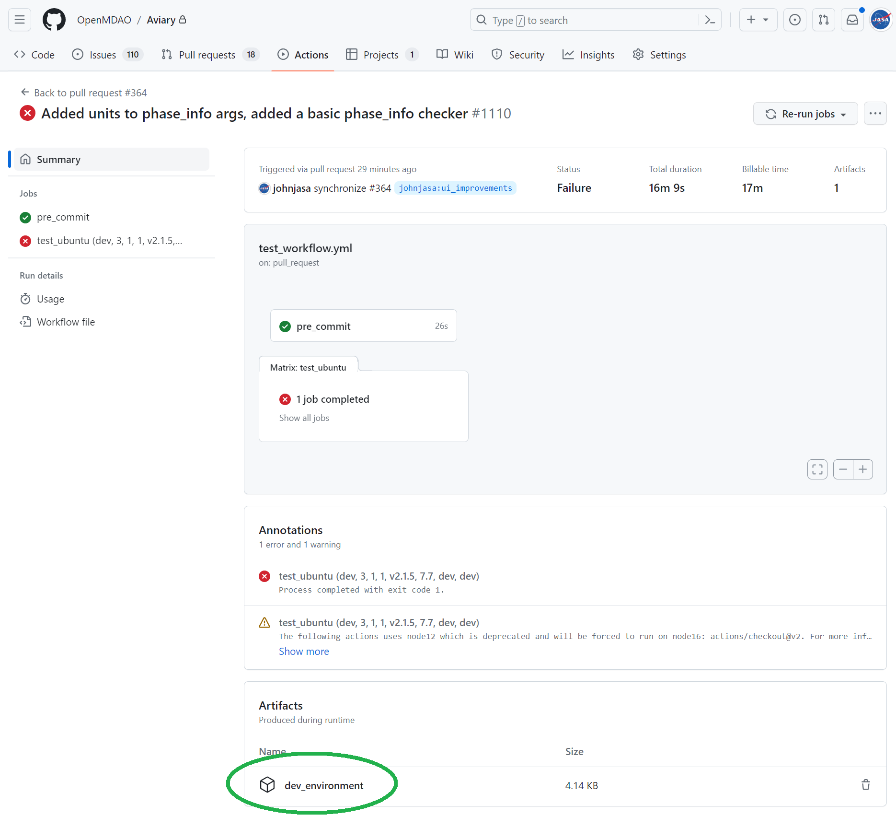

# Using Dev Environments from GitHub Actions

## Introduction

If you've encountered a GitHub Actions failure case and wish to debug it locally, this guide will help you set up an identical development environment to the one used.

## Prerequisites

- You should have `conda` installed. Optionally, you can also install `mamba` for faster package installations.
- You should have Git and Bash installed.

## Steps

### 1. Download the environment YAML file

- Navigate to the failing pull request (PR) in your repository. See the first screenshot below for what an example of a failing PR looks like.
- Locate the failed GitHub Actions workflow and go to the relevant "Artifacts" section to download the environment YAML file as shown in the screenshot.
- The downloaded YAML file will be in a zipped format.




### 2. Unzip the YAML file

- Unzip the downloaded file to obtain the YAML file.
- Place this YAML file in your local `Aviary/.github` folder. The reason we recommend this location is that we have a helper script in this folder that you will use in the next steps.

### 3. Optional: install mamba

- While `conda` works well for package management, we recommend using `mamba` as it is generally faster.
- You can read more about mamba in its [user guide](https://mamba.readthedocs.io/en/latest/user_guide/mamba.html).
- To install mamba, follow the installers on [this link](https://github.com/conda-forge/miniforge#mambaforge).

### 4. Run the helper script

- Open your terminal and navigate to the `Aviary/.github` folder where you placed the YAML file and the script.
- Run the following command:

    ```bash
    ./install_env_from_github.sh <name_of_yml_file.yml> [optional env_name]
    ```

- Note: The script may prompt you if an environment with the same name already exists. Type 'y' if you're fine with overwriting that environment.
- Note: You may need to add execute privileges to install_env_from_github.sh. This can be accomplished using: ```chmod +x install_env_from_github.sh```

## What the script does

The `install_env_from_github.sh` script does the following:

1. Checks for prerequisites and initiates package management via either `conda` or `mamba`.
2. Reads the given YAML file and creates an intermediate version without specific packages like Aviary, pyOptSparse, and Simupy.
3. Checks if `openmdao` and `dymos` are set to development versions, and if so, prepares to install them from GitHub.
4. Creates a new conda environment with the remaining packages.
5. Activates the new environment.
6. Installs development versions of `openmdao` and `dymos` from GitHub, if flagged.

## Post-installation steps

- Once your new environment is set up, make sure to activate it if it is not already active from the helper script:

    ```bash
    conda activate debug_env
    ```

- After activation, run `testflo .` inside the Aviary directory and you should see the same expected failures as GitHub Actions showed.
  
  ```bash
  testflo .
  ```

- Compare your local test results with the GitHub Actions results to identify discrepancies or issues.
- Debug! Good luck and have fun.
