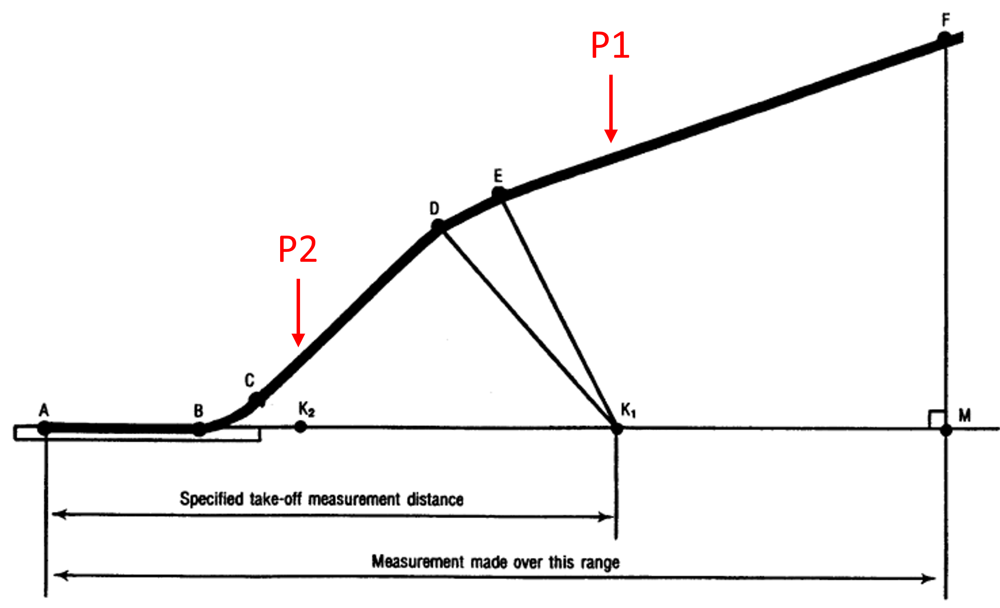

# Level 2 Detailed Takeoff and Landing

```{note}
Here we discuss how to optimize the takeoff and landing sequences for aircraft using the Level 2 interface in Aviary.
If you need more precise control over the flight profile and the trajectory definition, please see the Level 3 interface detailed in [FLOPS Based Detailed Takeoff and Landing](../user_guide/FLOPS_based_detailed_takeoff_and_landing.ipynb).
That other example also computes the balanced field length for the aircraft using branching trajectories, which is not done here.
```

This doc page discusses how to use Aviary to perform detailed takeoff and landing simulations for aircraft using the Level 2 interface.
When we say "detailed takeoff and landing," this simply means that we model the aircraft trajectory in more detail than other simplified mission representations.
This means two main things:

- We model the takeoff portion of flight using a series of phases, such as ground roll, rotation, and multiple climb phases. Similarly, we model the landing portion of flight using a series of phases, such as approach, flare, and touchdown.
- Instead of using the height-energy approximation for the aircraft equations of motion, we use the full two-degree-of-freedom (2DOF) equations of motion. This means that there is a notion of angle of attack and aircraft pitch within the flight dynamics equations. These mission methods are both detailed in the [Mission Analysis doc page.](../theory_guide/mission.md)

These considerations allow us to model specific parts of the aircraft trajectory in more detail, which is especially useful for certain performance-based disciplinary analyses, such as acoustics and controls.

## How we define the trajectories

We use the `phase_info` object to define the trajectories.
We generally use polynomial controls of order 1 to simplify the optimization problem.
What this means is that the control variables (Mach and altitude) are linear within one phase.
You can increase the order of the polynomial control or set `use_polynomial_control` to `False` to have the optimizer control the values at every node.

We add any constraints needed for the trajectory in the `constraints` argument passed inside of `user_options`.
Any arbitrary variable present in the phase ODE can be constrained.
You can use boundary or path constraints by setting the `type` argument in the constraint dict.

We optimize mach and altitude using the `optimize_mach` and `optimize_altitude` flags.
You can choose to disable optimization of these variables by setting them to `False` for any phase.
Aviary internally handles the connections for Mach and altitude between the phases to ensure continuity in the trajectory.
You can choose how to enforce that the throttle value is between 0 and 1; solver bounded, with boundary constraints, or path constraints.

Initial guesses are important to help the optimizer converge well.
These guesses are much more important for the 2DOF model than the height-energy model.

In these examples we only model the takeoff and landing trajectories individually, not as part of a full mission.
This is because acoustic certification is typically done for these phases separately.
However, you can easily combine these phases into a comprehensive mission by adding the takeoff, flight, and landing phases to the mission in that order.
The `2DOF` mission method (not the `solved_2DOF` mission method used here) models the entire mission including takeoff and landing phases.

## Defining the takeoff trajectory

We follow the diagram below to model the takeoff trajectory, which includes the ground roll, rotation, liftoff, and climb phases.
We add constraints at specific points in the flight to ensure we hit certain altitudes and distances needed for acoustic certification.
P1 and P2 correspond to microphone locations for acoustic certification.

```{note}
Each of the phases modeled in the takeoff trajectory use the solved 2DOF model *except* for phase AB which uses a specific ground roll model.
```



## Defining the landing trajectory

For the landing trajectory, we also follow a diagram that outlines the approach and touchdown phases.
This trajectory is simpler than the takeoff trajectory.
P3 corresponds to the microphone location used for acoustic certification.

