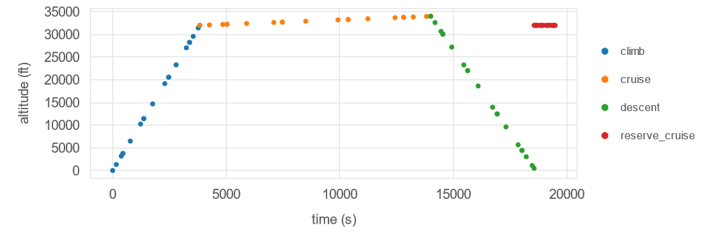
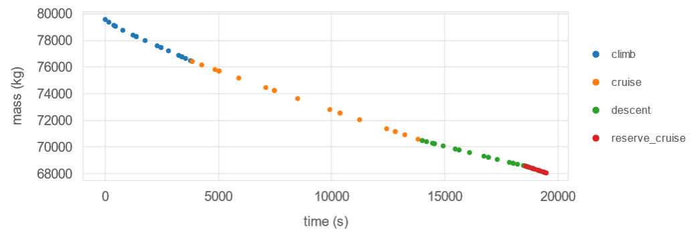
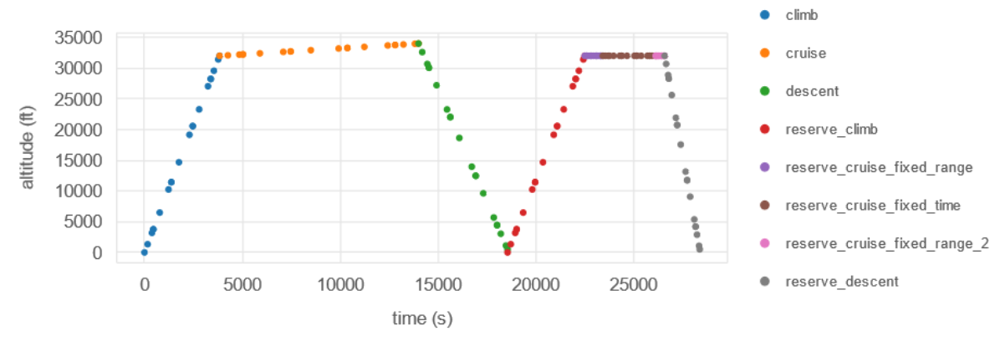

# Reserve Mission Examples

The reserve mission examples are broken up into two sections: height-energy missions, and 2DOF missions.
By default Aviary uses a height-energy formulation unless you have specified otherwise.
Single phase reserves for fixed-time and fixed-range will be presented as well as an example of a multiphase reserve mission.
An overview of how to formulate a reserve mission is presented in [Reserve Mission User Guide](../user_guide/reserve_missions.md).

All of the reserve mission examples are available in `aviary/examples/reserve_missions/`
The examples start with `run_basic_aviary_example.py` and add reserve phases.
The 2DOF examples use `aircraft_for_bench_GwGm` instead of `aircraft_for_bench_FwFm` and import the default two_dof phase_info instead of the `example_phase_info`.

## Fixed Range Reserve

The simplest example of a reserve mission implementation can be seen in fixed-range examples, which add a fixed-range cruise to the end of the basic mission.

* Height Energy: `run_reserve_mission_fixedrange.py`
* Two Degree of Freedom: `run_2dof_reserve_mission_fixedrange.py`

This is performed by making a copy the cruise `phase_info` object and adding `"reserve": True,` and `"target_distance": (200, 'km'),`.

The results of this study are shown in the `traj_results_report.html`.
The first thing we review is the altitude plot.
This plot clearly shows that a reserve cruise phase was created at the end of the regular mission.
There is no climb phase in that reserve; we jump to cruising altitude and cruise for 200 km.

Additionally when looking at the mass and distance plots from the same study, we can see that the regular and reserve phases are connected properly.
There is no discontinuity between regular and reserve phases for either distance or mass.

## Fixed Time Reserve

Similar to the fixed-range example, a simple fixed-time reserve mission is also provided.

* Height Energy: `run_reserve_mission_fixedtime.py`
* Two Degree of Freedom: `run_2dof_reserve_mission_fixedtime.py`

Again, we make a copy of the cruise phase from `phase_info` and then modify it by adding `"reserve": True,` and `"target_duration": (30, 'min'),`.
We have also removed other references to time in the reserve phase definition.
We do not list `initial_guesses:time`, `user_options:duration_bounds`, or `user_options:fixed_duration`.
All of these are set automatically when we set `target_duration`.

## Multiphase Reserve Mission

The last example reserve mission includes five phases: climb, cruise for distance, cruise for time, cruise for distance, descend.

* Height Energy: `run_reserve_mission_multiphase.py`
* Two Degree of Freedom: `run_2dof_reserve_mission_multiphase.py`

This demonstrates how to create an arbitrarily ordered set of phases for reserve, including climb and descent phases.
All of these reserve phases are tagged with `"reserve": True,`.

Results from this mission can be seen in the figure below.

There are three distinct cruise segments and the added reserve climb and reserve descent show a more realistic flight profile for a diverted aircraft.
