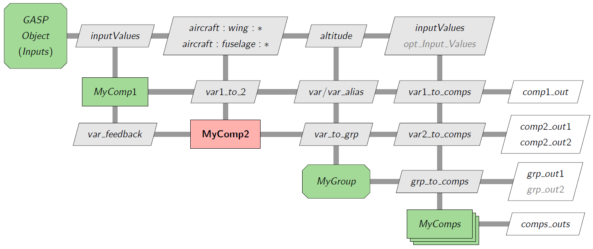

# Using XDSM

Aviary has two ways to visualize its structures. One way is the OpenMDAO [N2 Diagram](https://openmdao.org/newdocs/versions/latest/features/model_visualization/n2_details/n2_details.html). Another is the [XDSM](https://mdolab-pyxdsm.readthedocs-hosted.com/) from MDO Lab. In this page, we explain how XDSM diagrams are organized in Aviary. 

## What is XDSM?

The [Practical MDO](https://openmdao.github.io/PracticalMDO/) website has a [fantastic post on understanding XDSM diagrams](https://openmdao.github.io/PracticalMDO/Notebooks/ModelConstruction/understanding_xdsm_diagrams.html). This lesson also includes a [helpful video](https://www.youtube.com/watch?v=yutKRwIL3BA).

## Creation of all XDSM diagrams

All the XDSM files reside in `xdsm` directory. And all of their names end with `_xdsm.py`:

```bash
......
descent1_xdsm.py
descent2_xdsm.py
design_load_xdsm.py
empennage_size_xdsm.py
......
```

There is a particular python file `run_all.py` in `xdsm` folder. Using `run_all.py` in your Aviary environment, you can generate all the XDSM diagrams:

```bash
python run_all.py
```

If everything runs correctly, you will see a list of `.pdf` files (e.g. `accel_xdsm.pdf`) and some `sub-folders` (e.g. `accel_specs`). Those sub-folders are created for [unit testing](https://docs.python.org/3/library/unit test.html).

## The Aviary rules

Readers should read about basic XDSM from MDO Lab [website](https://mdolab-pyxdsm.readthedocs-hosted.com/). Besides those, Aviary has its own rules. Let's take a look at a sample XDSM diagram:



Let us use the above example to discuss how Aviary uses XDSMs:

1. All XDSM diagram files end with `_xdsm.py` in `xdsm` folder.
2. Some XDSM diagrams are coupled with sub-folders with names ending with `_specs`. They correspond to related Aviary unit tests. Search keyword [assert_match_spec](https://github.com/OpenMDAO/om-Aviary/blob/main/aviary/utils/test_utils/IO_test_util.py) for a specific unit test.
3. Single components have rectangular shape (e.g. `MyComp1`).
4. Groups of components have rectangular shape with chopped corners (e.g. `MyGroup`).
5. System input on the top-left corner is shown as a group (e.g. `Group Object (Input)`). This is a special symbol for the whole diagram (which is a group).
6. The components linked to unit tests are in bold. A `_specs` folder contains the data to be validated.
7. Components with feedback variables are shown in pink red background (e.g. `MyComp2` with feedback variable `var_feedback`). In this case, components are not run only sequentially, but in a loop. Usually, a nonlinear solver is required for the coupled subsystem.
8. Conditional variables, components, and groups are grayed out (e.g. `opt_Input_value`). Sometimes, a component or a component group can be left off. They are shown using gray color indicating they are conditional. Users can configure the appropriate Python file to hide them in the diagram.
9. Array of components and groups are shown as stacks (e.g. `MyComps`). A stack of components is a set of systems that are not connected to each other. Usually they can be run in parallel.
10. "InputValues" represents a list of input variables if the user set `simplified = True` when an XDSM diagram is generated. Otherwise, a complete list of variables are shown. Sometimes this list can be too long. We give an option for users to simplify the display of input variables.
11. Variables like "aircraft:wing:\*" are lists of some variables in `Aircraft.Wing` class. We display them this way to make the XDSM diagram easy to read. Sometimes, these lists can be very long and it is impractical to show all of them. If "aircraft:wing:\*" is an input to a group, it is possible that this group has its own XDSM diagram.
12. In the source code of some of the XDSM diagrams, there are boolean variables to control the inputs/outputs of variables, components, and groups (e.g. `simplified` or `show_outputs`). Users can set them themselves and regenerate those diagrams with different appearances. The next section shows how to regenerate a single diagram instead of all.

## Unit Testing

All XDSM diagrams within Aviary are tested against the actual Aviary code.
This means that all of the inputs and outputs for each component and group are checked against the XDSM diagram.
If you modify Aviary, you should run the unit tests to ensure that the XDSM diagrams are still valid and update the XDSM diagrams if necessary.
