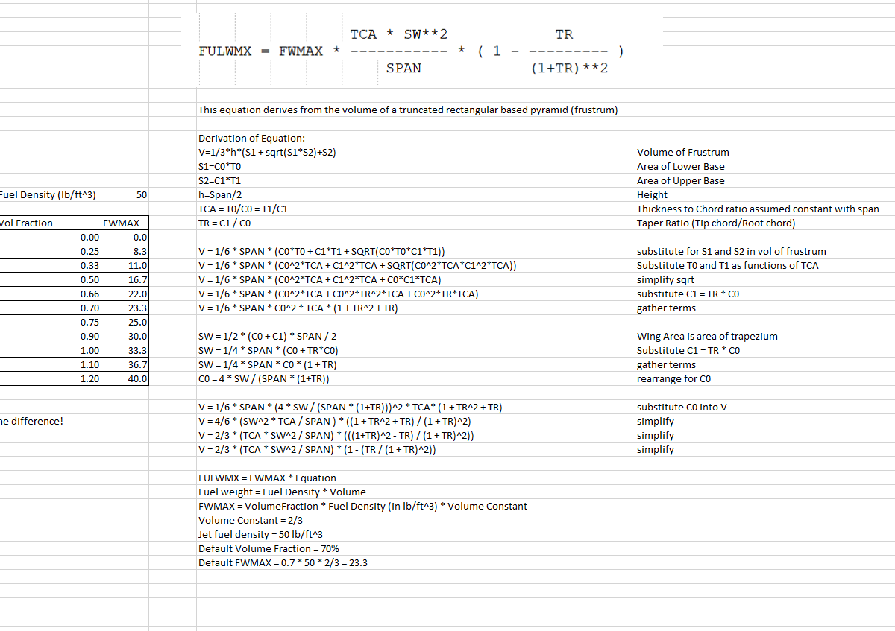

# Core Mass Subsystem

The core mass subsystem is responsible for calculating the mass properties of the aircraft.
This includes the empty weight, fuel weight, payload weight, and other mass properties.

```{note}
This section is under further development.
```

## FLOPS Based Mass Subsystem

### Fuel_Capacity

The Fuel Capacity Group contains 4 subsystems:

1. Wing Fuel Capacity

    There are 2 different relationships that can be used, and Aviary will switch between them based on the value of the Aircraft.Fuel.WING_REF_CAPACITY_TERM_A parameter.

    If Aircraft.Fuel.WING_REF_CAPACITY_TERM_A > 0:

    Aviary allows the user to specify their own relationship for fuel capacity as a polynomial function of the difference in wing area to some reference area. This is for compatability to legacy FLOPS, but in reality an aviary user will probably write their own OpenMDAO component for calculating wing fuel capacity rather than fitting their own coefficients to an equation of the form:

    Wing Fuel Capacity = Wing_Reference_Capacity * (coeff_a * Area Delta^1.5 + coeff_b * Area_Delta)

    Where coeff_a and coeff_b are user specified (Aircraft.Fuel.WING_REF_CAPACITY_TERM_A, Aircraft.Fuel.WING_REF_CAPACITY_TERM_B)

    Where Area_Delta = Aircraft.Wing.AREA - Aircraft.Fuel.WING_REF_CAPACITY_AREA (user specified)

    Else (default):

    Aviary assumes that the wing volume can be approximated as a rectangular based pyramid, and that the available volume for fuel is a user specified fraction of this theoretcial volume (Aircraft.Fuel.WING_FUEL_FRACTION). The derivation of Aviary's theoretical volume calculation is included below:

    

    Aviary then converts the volume to a capacity (lbm) using the user specified fuel density (Aircraft.Fuel.DENSITY).

2. Fuselage Fuel Capacity

    Fusleage Fuel Capacity  = Total Fuel Capacity - Wing Fuel Capacity

3. Auxiliary Fuel capacity

    Auxiliary Fuel Capacity = Total Fuel Capacity - Wing Fuel Capacity - Fuselage Fuel Capacity

4. Total Fuel Capacity

    Total Fuel Capacity = Wing Fuel Capacity + Fuselage Fuel Capacity + Auxiliary Fuel Capacity

It is possible for Aviary to calculate negative fuel capacities depending on user overrides and the input wing geometry. These situations are not currently flagged to the user.
