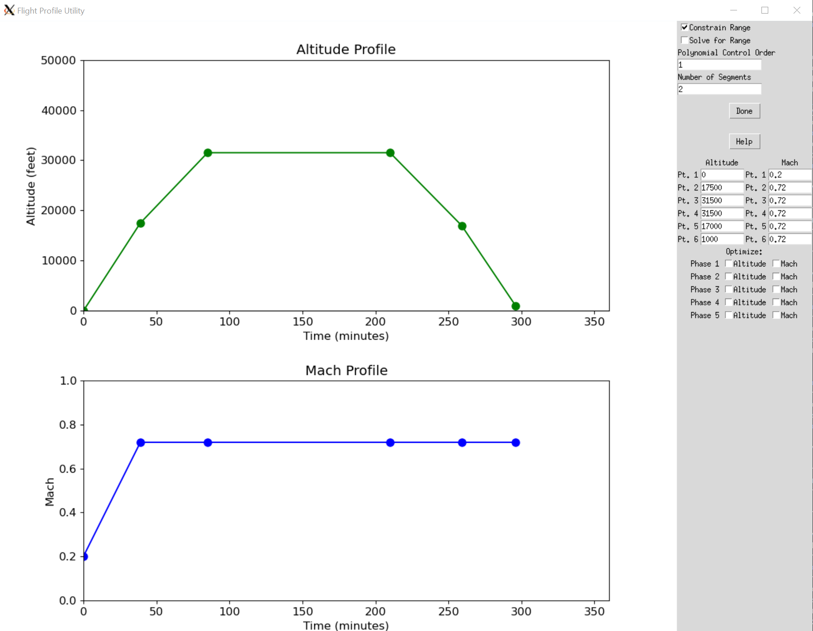

# Drawing and running simple missions

## Overview

Aviary comes with a simple built-in graphical interface for defining missions.
This tool can be accessed via the command line and provides an interactive way to define flight phases, including altitude, Mach number, and optimization parameters.

It is specifically made to only be used with the `"simple"` mission method.
You could use the results from the GUI to run a mission with a different method, but it would require manually changing the generated `phase_info` dict.



## Getting Started

To launch the Flight Profile Utility, use the following command in your terminal:

```bash
aviary draw_mission
```

This command will open a graphical interface where you can interactively design a flight profile.

```{note}
If you are [WSL on Windows](https://learn.microsoft.com/en-us/windows/wsl/install) you might need to install an [X Server](https://sourceforge.net/projects/xming/) to run the GUI without issues. If you do this, also modify your `.bashrc` file to include this line: `export DISPLAY=localhost:0.0`. 
```

## Graphical Interface Usage

### Main Components

1. **Altitude Plot**: Graphically represents the altitude profile over time. Users can add and drag points to adjust the altitude at different mission times.

2. **Mach Plot**: Similar to the Altitude Plot but for the Mach number profile.

3. **Control Panel**: Contains various options and controls for customizing the flight profile and running simulations.

### Interactive Features

- **Adding Points**: Click on either the Altitude or Mach plot area to add a new point. Points on the Altitude plot represent altitude (in feet) at a specific time (in minutes), whereas points on the Mach plot represent the Mach number at specific times.

- **Dragging Points**: Points on both plots can be dragged vertically to adjust values. This allows for fine-tuning of the flight profile.

- **Removing Points**: Currently, the utility does not support direct removal of points. Adjust the profile by dragging or adding new points.

### Input Fields and Options

1. **Optimize Mach**: Toggles optimization for Mach number during each phase of the flight.

2. **Optimize Altitude**: Toggles optimization for altitude during each phase.

3. **Constrain Range**: If checked, imposes constraints on the flight range.

4. **Solve for Range**: Calculates the total flight range based on the profile.

5. **Polynomial Control Order**: Sets the polynomial order for control optimization. This is for all phases. You can modify behavior on a per-phase basis by editing the outputted `phase_info` dict.

6. **Number of Segments**: Defines the number of segments for the mission profile. This is for all phases. You can modify behavior on a per-phase basis by editing the outputted `phase_info` dict.

7. **Inputting Altitude and Mach values**: In these text fields you can directly input values for altitude and Mach number. These will directly update the plots.

8. **Phase-specific Optimization**: Each phase (line in the plots) has two checkboxes for 'Optimize Mach' and 'Optimize Altitude', allowing for phase-specific optimization settings.

### Output

Upon completion, the tool outputs a Python script named `outputted_phase_info.py` in the current working directory.
This tool overwrites any existing file called `outputted_phase_info.py` in the current working directory.
This outputted file contains the `phase_info` dictionary, which holds the flight profile data structured for use in mission simulations.

```{note}
When using the outputted `phase_info` dict in a mission simulation, you can modify the settings by directly changing the outputted Python file.
```

The `phase_info` dictionary makes some assumptions about different settings which you can also modify.
For example, the time duration of each phase is controlled by the optimizer if `fix_duration` is False, though this can be changed to True to fix the duration of each phase.

## Running a Mission Simulation

After generating the flight profile, use the `run_mission` command to simulate the mission.
This command utilizes the `phase_info` from `outputted_phase_info.py` and simulates the mission based on the defined parameters.
You can use the `--phase_info` flag to specify the path to the `outputted_phase_info.py` file.
Here we use a benchmark case as the inputted .csv file, though you can use any Aviary .csv here that defines an aircraft.

```bash
aviary run_mission --phase_info outputted_phase_info.py validation_cases/benchmark_tests/test_aircraft/aircraft_for_bench_FwFm.csv
```

You can also supply an optimizer, otherwise the default (SLSQP) will be used.
Here is how you'd run the mission with the IPOPT optimizer:

```bash
aviary run_mission --optimizer IPOPT --phase_info outputted_phase_info.py validation_cases/benchmark_tests/test_aircraft/aircraft_for_bench_FwFm.csv
```