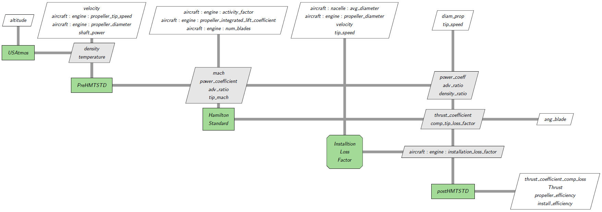
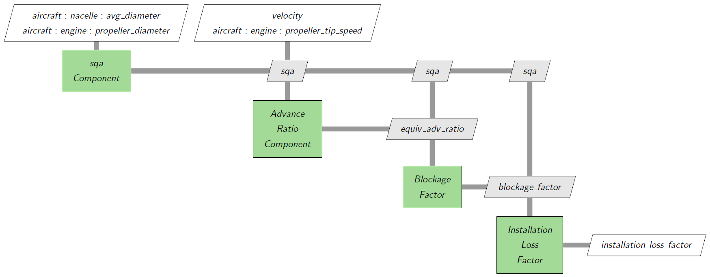

# Hamilton Standard Propulsion Model

In the 1970s, NASA contracted Hamilton Standard to forecast into the future mid-80s to the 90s what they thought advanced propellers would look like.
The result is what we call “Hamilton Standard model” used in Aviary today.
The [Hamilton Standard Documentation is publicly available](https://ntrs.nasa.gov/api/citations/19720010354/downloads/19720010354.pdf).
You can find the definitions, methodology, and Fortran code in the document.
In Aviary, we implement only one of the computation options: the code computes the corresponding thrust for a given horsepower.

Below is an XDSM diagram of Hamilton Standard model:



The inputs are grouped in three aspects:

Geometric inputs:

- Propeller diameter
- Activity factor per blade (range: 80 to 200, baseline: 150)
- Number of blades (range: 2 to 8)

Power inputs:

- Shaft power to propeller (hp)
- Installation loss factor (0 to 1)

Performance inputs:

- Operating altitude (ft)
- True airspeed (knots)
- Propeller tip speed (Usually < 800 ft/s)
- Integrated lift coefficient (range: 0.3 to 0.8, baseline: 0.5)

Some of the inputs are valid for limited ranges.
When using an odd number of blades, the Hamilton Standard model interpolates using the 2, 4, 6 and 8 blade data.
The corresponding outputs are:

Geometric outputs:

- Design blade pitch angle (at 0.75 Radius)

Power outputs:

- Installation loss factor
- Tip compressibility loss factor
- Power coefficient
- Thrust coefficient (rho=const, no losses)

Performance outputs:

- Flight Mach number
- Propeller tip Mach number
- Advance ratio
- Tip compressibility loss factor
- Thrust
- Propeller efficiency with compressibility losses
- Propeller efficiency with compressibility and installation losses

As shown in the above XDSM diagram, the model is an OpenMDAO group that is composed of four components and one subgroup:

- `USatmos`
- `PreHamiltonStandard`
- `HamiltonStandard`
- `InstallLoss`
- `PostHamiltonStandard`

`USatmos` component provides the flight conditions.
The flight conditions are passed to the `PreHamiltonStandard` component which computes the propeller tip Mach number, advance ratio, and power coefficient.
These values are then fed into the `HamiltonStandard` component.

`HamiltonStandard` is the core of the model.
Given the power coefficient (CP) and advance ratio (J), it finds the blade angle (BL) by a CP-BL chart by tracing the advance ratio.
Then with the blade angle, it finds the thrust coefficient (CT) using its CT-BL chart by tracing advance ratio again.
This algorithm is shown in the below pair of charts.
The CP → BL → CT chart matching algorithm is based on baseline data.
If the user-inputted values are not in the valid region, it will first convert them to those baseline parameters by a sequence of interpolations to do the necessary corrections.
The newly converted parameters are called “effective parameters” (e.g., CPE and CTE).
The outputs are blade angle, thrust coefficient and tip compressibility loss factor.


Finally, the thrust is computed in the `PostHamiltonStandard` component based on thrust coefficient and tip compressibility loss factor.

The Hamilton Standard model uses wind tunnel test data from uninstalled propellers.
When a nacelle is mounted behind the propeller, an installation loss factor is introduced.
The installation loss factor can be given by the user or computed.
If it is computed, we need another group of components as shown below:



This diagram is represented by `InstallLoss` group in the first diagram.
Nacelle diameter is needed when installation loss factor is computed.
We use the average nacelle diameter.

The newly added aviary options and variables are:

```none
Aircraft.Engine.PROPELLER_DIAMETER
Aircraft.Engine.PROPELLER_INTEGRATED_LIFT_COEFFICIENT
Aircraft.Engine.PROPELLER_ACTIVITY_FACTOR
Aircraft.Engine.NUM_BLADES
Aircraft.Design.COMPUTE_INSTALLATION_LOSS
Dynamic.Mission.PROPELLER_TIP_SPEED
Dynamic.Mission.SHAFT_POWER
Dynamic.Mission.INSTALLATION_LOSS_FACTOR
```

To build a turboprop engine that uses the Hamilton Standard propeller model we use a `TurboPropDeck` object with `prop_model` set to `True`:

```python
engine = TurboPropDeck(options=options, prop_model=True)
```

Some inputs are options:

```python
options.set_val(Aircraft.Engine.PROPELLER_DIAMETER, 10, units='ft')
options.set_val(Aircraft.Engine.NUM_BLADES, val=4, units='unitless')
options.set_val(Aircraft.Design.COMPUTE_INSTALLATION_LOSS, val=True, units='unitless')
```

We set the inputs like the following:

```python
prob.set_val(f'traj.cruise.rhs_all.{Aircraft.Design.MAX_TIP_SPEED}', 710., units='ft/s')
prob.set_val(f'traj.cruise.rhs_all.{Dynamic.Mission.PERCENT_ROTOR_RPM_CORRECTED}', 0.915, units='unitless')
prob.set_val(f'traj.cruise.rhs_all.{Aircraft.Engine.PROPELLER_ACTIVITY_FACTOR}', 150., units='unitless')
prob.set_val(f'traj.cruise.rhs_all.{Aircraft.Engine.PROPELLER_INTEGRATED_LIFT_COEFFICIENT}', 0.5, units='unitless')
```
